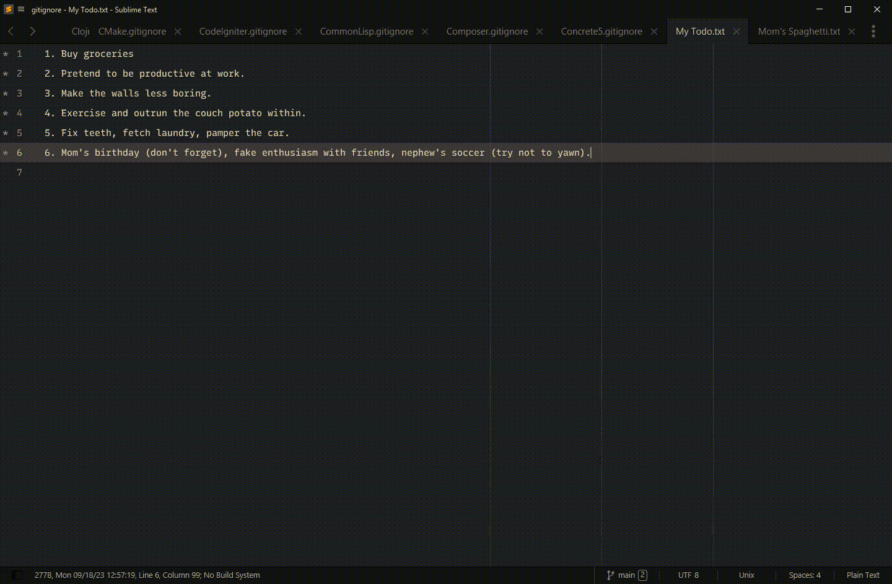
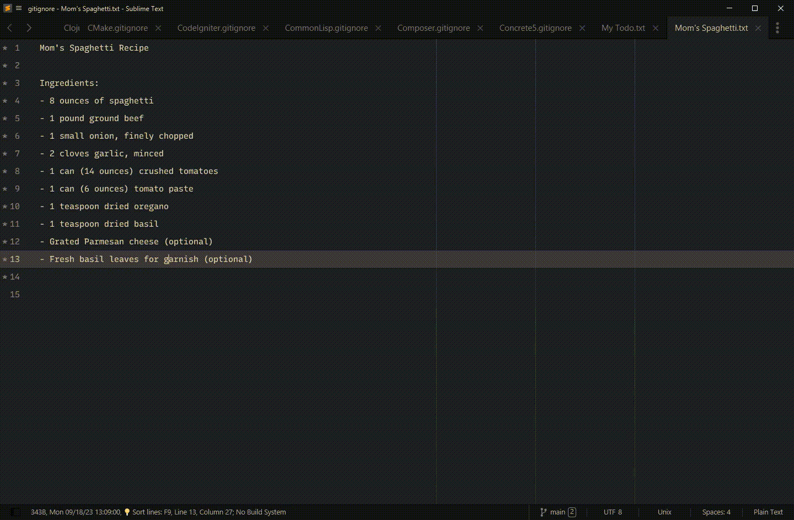
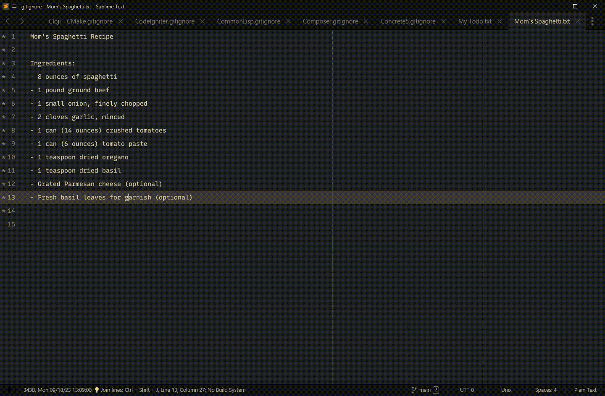
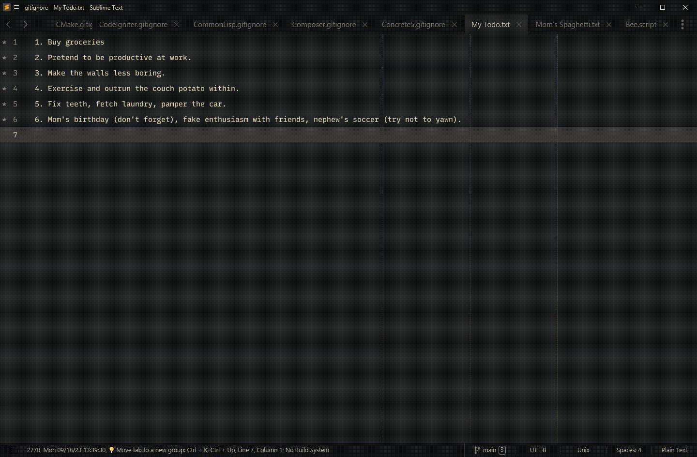
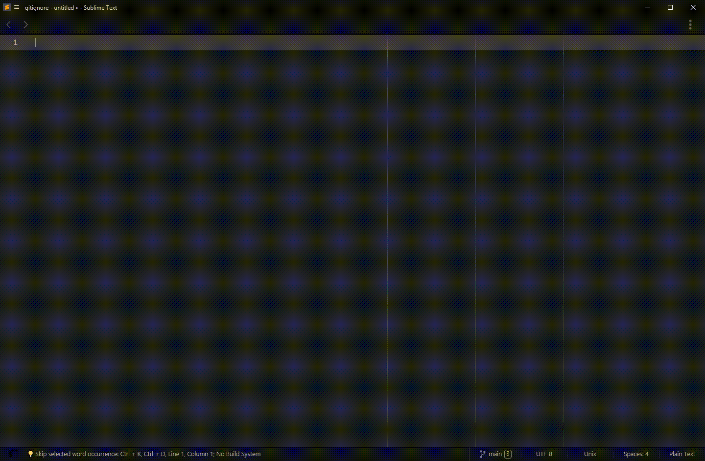

### 🧭 Compass - Better Code Navigation

<p align="center">
<a href="https://www.sublimetext.com/">
    </a>
<a href="https://packagecontrol.io/packages/Compass%20Navigator"> 
    </a>
<a href="https://github.com/kapitanluffy/sublime-compass/releases">
    </a>
<a href="https://github.com/sponsors/kapitanluffy">
    </a>
</p>

---

Lost? Tired of endlessly scrolling through tabs just to find the previous file you were working on?

Compass provides you the list of most-recently used tabs. It also helps you filter them by special tags!

By default, `ctrl+tab` jumps you to the next view in the MRU stack without showing the stack.
Compass provides you a visual guide of where you have been.

---

### Installation

1. In your package directory, clone the repo
```
git clone git@github.com:kapitanluffy/sublime-compass.git "Compass Navigator"
```

2. Run `Preferences: Compass Keybindings` and copy pre-commented the keybindings (or you can set it to your preferred keybinds)

3. Press `ctrl+tab` to show the Compass 🧭

### Contents
- [Opening Compass](#opening-compass)
- [Quick Switching](#quick-switching)
- [Selecting an Item](#selecting-an-item)
- [Closing Compass](#closing-compass)
- [Filtering Items](#filtering-items)
- [Opening Files](#opening-files)
- [Auto Closing Tabs](#auto-close-tabs)
- [Caching Items](#caching-items)

### Support ☕

Like my Sublime plugins? Keep the updates coming by supporting me on GitHub Sponsors, Ko-fi, or Patreon.
Your support will help fuel my coffee for my next coding session!

- https://github.com/sponsors/kapitanluffy
- https://patreon.com/kapitanluffy
- https://ko-fi.com/kapitanluffy

---

#### Opening Compass

> `ctrl+tab`

Open the quick panel. Displays most-recently used tabs by default.



#### Quick switching

You can do this by pressing `ctrl+tab` on the first and second items



#### Selecting an Item

> `ctrl+ctrl` (or press `enter`)

Select the current highlight and close the quick panel


#### Closing Compass

> `alt+alt` (or press `escape`)

Go back to the initial tab and close the quick panel



#### Filtering Items

To enable filters, you need to set `enable_tags` to `True`.
After that, you can filter items by typing `#`



#### Opening files

If you have [ripgrep](https://github.com/BurntSushi/ripgrep) set in the settings, you can enable this feature.
Please note that this will be slow in large projects!



#### Auto Close Tabs
Compass will automatically close the least used tab when you open the 1001th tab.
You can manage this limit by changing `max_open_tabs` or disable it by setting to `0`

#### Caching Items
Internally, Compass caches the MRU tabs. Reopening Sublime Text will not rebuild the MRU stack

The "Files" plugin which allows you to navigate to unopened files does not do this unfortunately.
By default, each time you open compass, the Files plugin will always refetch your file list

This sucks when you have a very large project. Enabling caching helps with showing 
compass immediately. The downside of this is that it won't see newly created files. 
I am currently working on fixing this with the help of another plugin called [FileWatcher](https://packagecontrol.io/packages/FileWatcher). 
For now, you can run `Compass: Reindex` to recognize new files.

If your Compass does not show up immediately, try enabling the cache under `plugins.files.enable_cache` in the settings
